  

<h1 align="center">Muja Kayadan</h1>

  <em>Machine Learning Engineer · Computer Vision · Travel as a feature, not a bug</em>

  

  
  
  
  
  

---

## About

> "Engineering is all about perspective, and traveling is such a builder for it."

I design machine learning systems for messy, real-world problems — especially computer vision and retrieval-augmented generation. I have 4+ years of experience shipping models, and I still get disproportionately excited about a clean dataset, a stubborn edge case, and a well-shaped egg.

- Working as a **Machine Learning Engineer**
- Building around **RAG**, **LLMs**, **VLMs**, and **computer vision**
- MS in Computer Science
- Lived in **7 countries**, visited **30+**

## Stack

  
  
  
  
  

  
  
  
  
  

  
  
  
  
  

## Snapshot

  
  

## Side quests

Things I keep coming back to when nobody asked me to:

- **Languages.** I collect countries and grammar the same way. Current Duolingo streak:
  
- **Chickens, seriously.** Co-author of [*High accuracy gender determination using the egg shape index*](https://www.nature.com/articles/s41598-023-27772-4) in *Nature Scientific Reports* — sexing chicks from egg shape so fewer male chicks get culled.
- **Chess vs models.** I benchmark how well LLMs actually play, not how well they talk about playing, in [LLM-Chess-Eval](https://github.com/mujakayadan/LLM-Chess-Eval).
- **Career tooling.** I like automating the unfun parts of job search. [YARBA](https://www.yarba.app) is the current app ([backend](https://github.com/mujakayadan/yarba-backend), [frontend](https://github.com/mujakayadan/yarba-frontend)). [EnvMasker](https://github.com/mujakayadan/EnvMasker) hides secrets before they leak.

### Travel & living map

Countries in coral are places I have lived. Blue is everywhere I have been.

  

## Featured work

<table>
  <tr>
    <td width="50%" valign="top">
      <h3><a href="https://www.yarba.app">YARBA</a></h3>
      Portfolio-first AI for truthful resumes, cover letters, and job applications. Successor to Resume-Builder-TeX.
      

        
        
      

    </td>
    <td width="50%" valign="top">
      <h3><a href="https://github.com/mujakayadan/EnvMasker">EnvMasker</a></h3>
      Masks <code>.env</code> values with asterisks so a quick screen share does not become an incident.
      

        
      

    </td>
  </tr>
  <tr>
    <td width="50%" valign="top">
      <h3><a href="https://github.com/mujakayadan/LLM-Chess-Eval">LLM-Chess-Eval</a></h3>
      A chess-playing benchmark for language models. Less trash talk, more illegal moves.
      

        
        
      

    </td>
    <td width="50%" valign="top">
      <h3><a href="https://github.com/mujakayadan/Image_Stitching_OpenCV">Image Stitching</a></h3>
      Panorama stitching in C++ and OpenCV — old-school geometry, still satisfying.
      

        
        
      

    </td>
  </tr>
</table>

## Connect

  
  
  
  

